This repository contains example [Vega](https://vega.github.io/vega/) visualizations which can be integrated into your InUse [synoptics](https://inuse.gitbook.io/docs/features/content/synoptic) and [dashboards](https://inuse.gitbook.io/docs/features/content/dashboard).

To configure a visualization:
1. Download the relevant JSON file. 
2. Edit the file and replace `model_name` by the name of the model from which to retrieve the properties values.
  
        // Which index to search
        index: "model_name"
 3. Set the various `field` variables to the relevant model properties. Look for `variable<x>` references.
 
       ```
       
       {
            time_buckets: {
              sum: {
              // Target 
                field: "variable1"
              }
            },
            time: {
              sum: {
                field: "variable2"
              }
            }
          } 
        }
       
  4. Add a Vega element in the target synoptic or dashboard.
  5. Copy and paste the file content into the definition text box of the element.

# Gallery

|   |   |  |
| :---: | :---: | :---: |
|  |  |  | 
| [Gauge Template 1](./gauge1_code.json) | [Gauge Template 2](./gauge2_code.json) | [Gauge Template 3](./gauge3_code.json) |
| 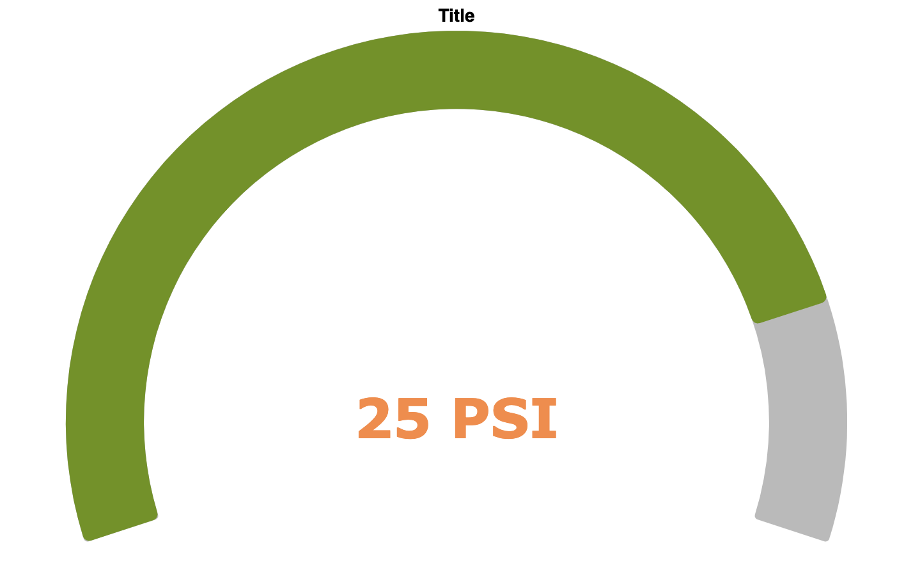 |  | 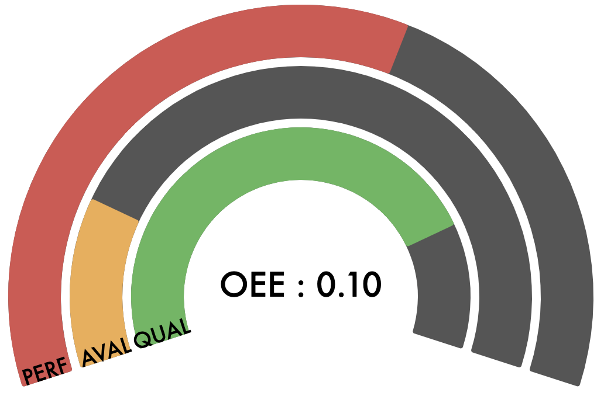 | 
| [Gauge Template 4](./gauge4_code.json) | [Gauge Template 5](./gauge5_code.json) | [OEE Template 1](./OEE1_code.json) |
| 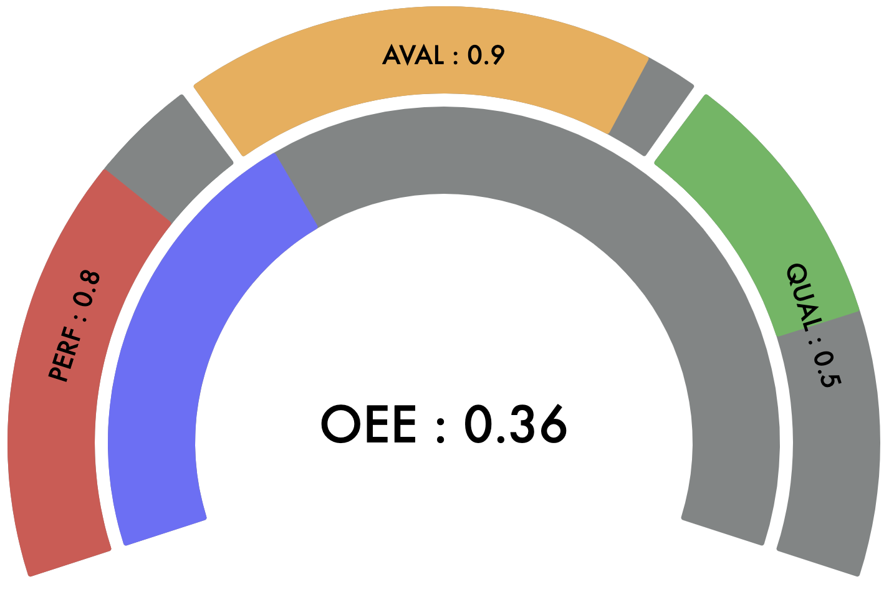 | 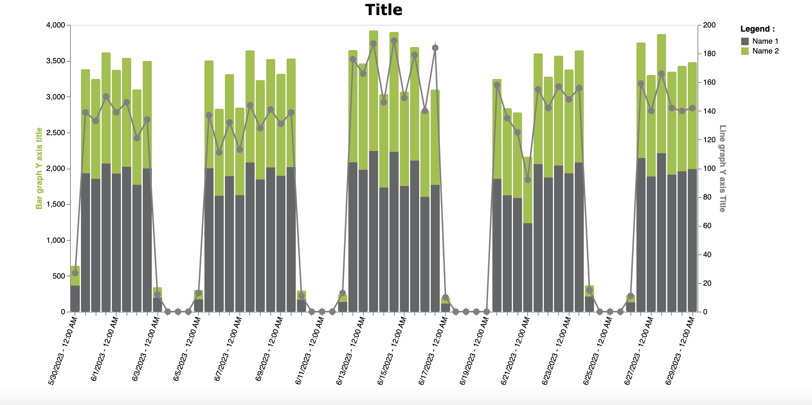 |  | 
| [OEE Template 2](./OEE2_code.json) | [Bar and Line Graph with fold transform](./graph1_code.json) | |
| 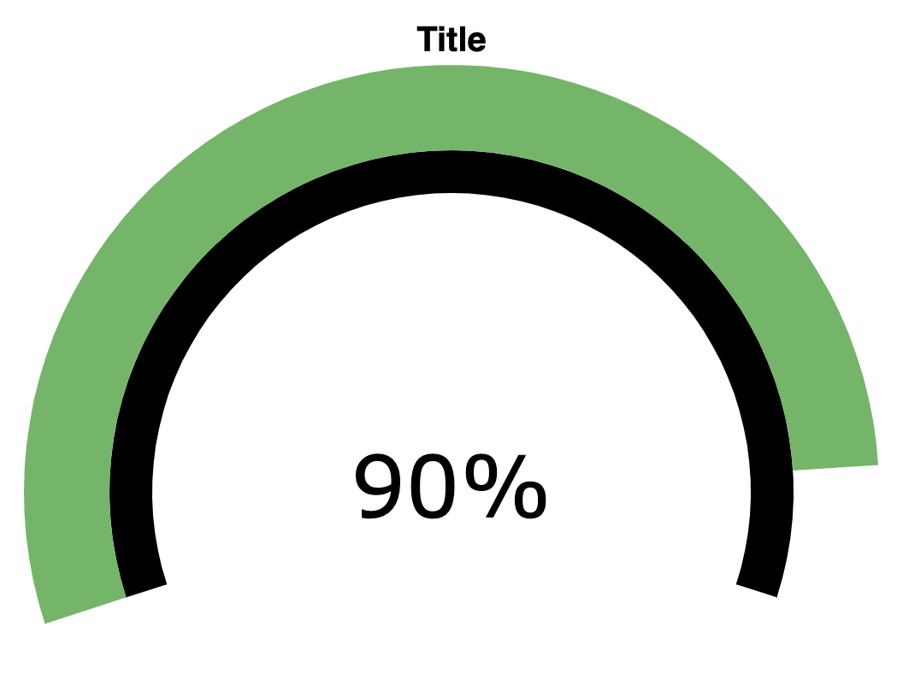 | 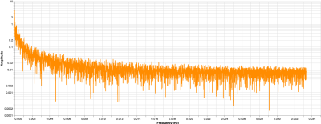 | 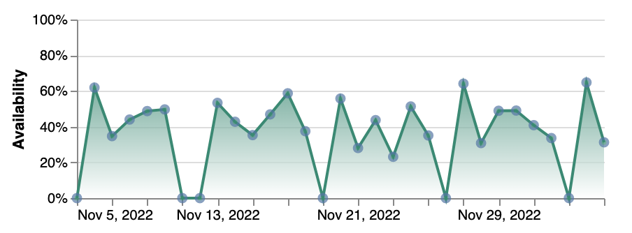 |
| [Gauge with ElasticSearch Request](./gauge1.json) | [Spectral representation](./fft1.json) | [Area chart with points](./area_chart_with_points.json) |                              
| 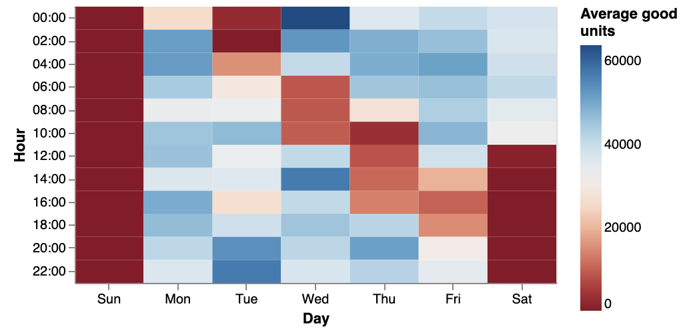 | 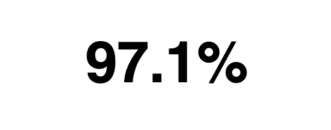 | 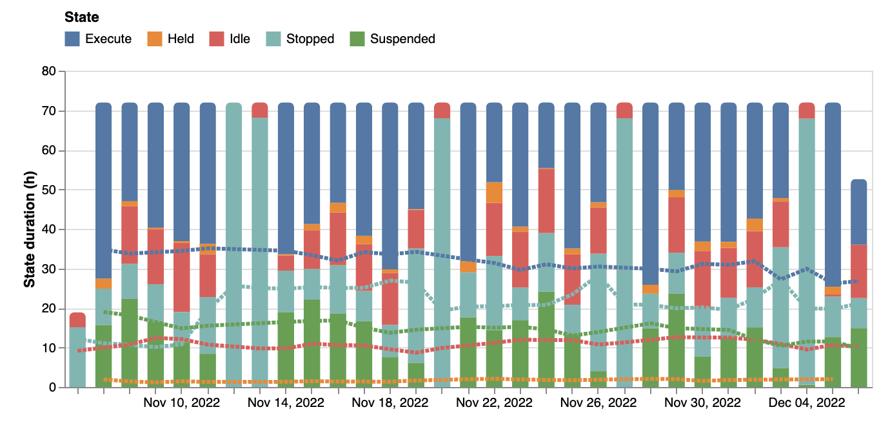 | 
| [Average production calendar](./average_production_calendar.json) | [Average quality metric (aggregation combination)](./average_quality_metric.json) | [Bar chart with trends and interactive legend](./bar_chart_with_trends_and_interactive_legend.json) |
| 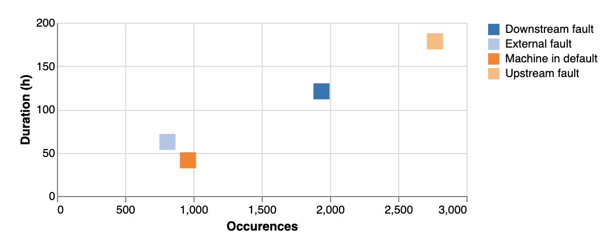 | 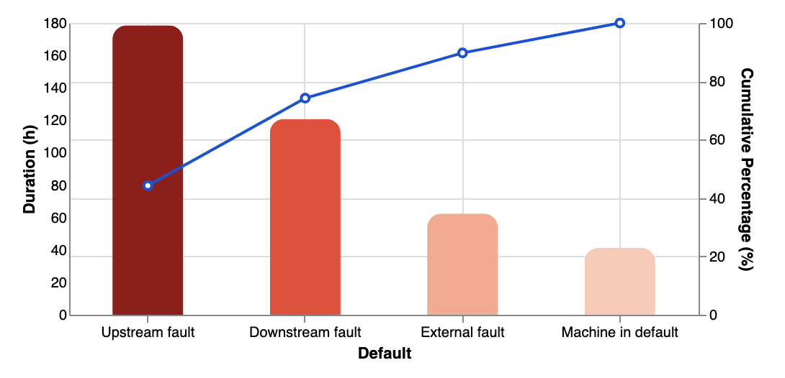 | 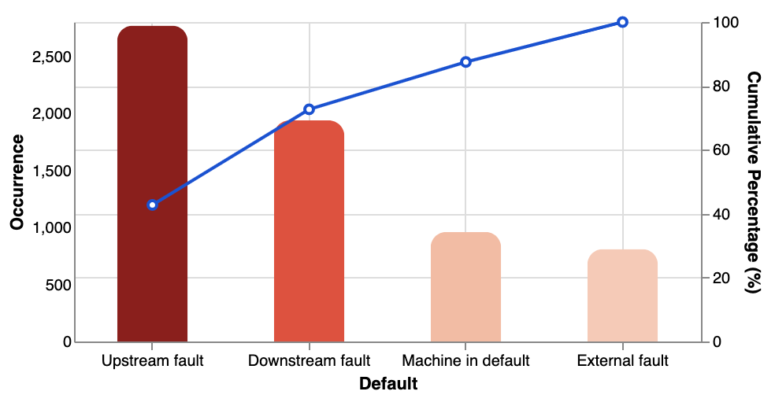 | 
| [Default duration and occurrence pareto](./default_duration_and_occurrence_pareto.json) | [Top 10 default duration pareto](./top_10_default_duration_pareto.json) | [Top 10 default occurence pareto](./top_10_default_occurence_pareto.json) |
| 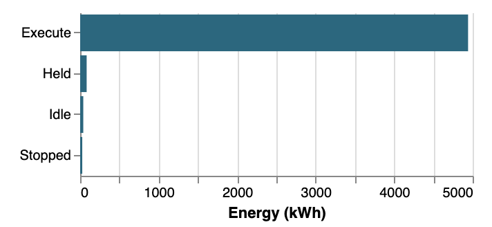 | 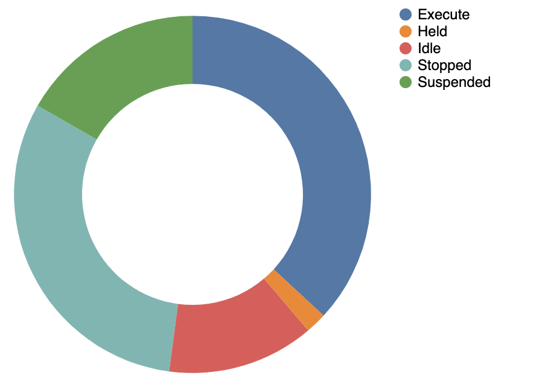 | 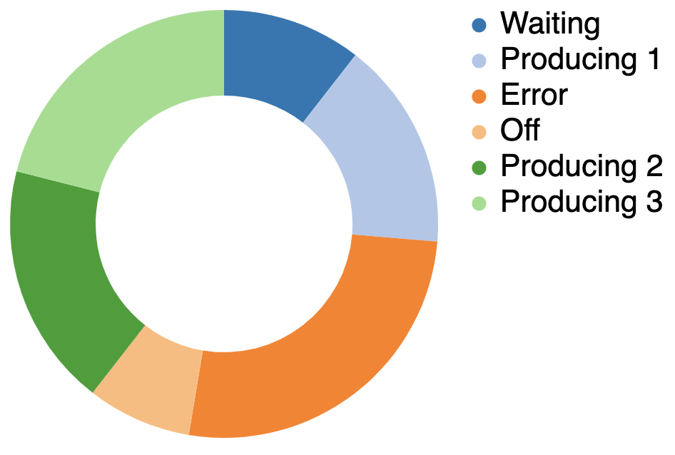 | 
| [Horizontal bar chart with text translation](./horizontal_bar_chart_with_text_translation.json) | [Machine state pie chart](./machine_state_pie_chart.json) | [Pie Chart with multiple ElasticSearch aggregations](pie_chart.json)  |    

# Contributing

General process to contibute a public Github repository:
1. Fork this repository.
2. Push your contribution to the forked repo.
3. Create a pull request onto the origin repo.

Useful details can be found [here](https://akrabat.com/the-beginners-guide-to-contributing-to-a-github-project/).

To add a visualization:
1. Edit your original JSON and rename the required `index` and `field` elements as described above.
2. Comment the various configuration sections. Be liberal with comments!
3. Create a visualization snipet for the gallery.
4. Edit the Gallery section of this file.
5. Commit

