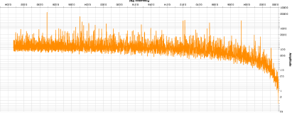

This repository contains example [Vega](https://vega.github.io/vega/) visualizations which can be integrated into your InUse [synoptics](https://inuse.gitbook.io/docs/features/content/synoptic) and [dashboards](https://inuse.gitbook.io/docs/features/content/dashboard).

To configure a visualization:
1. Download the relevant JSON file. 
2. Edit the file to set the `index` (model) from which to retrieve the properties values.
  
        // Which index to search
        index: INSERT INDEX (MODEL) NAME HERE
 3. Set the various `field` variables to the relevant model properties. Look for `INSERT VARx PROPERTY HERE` tags.
 
       ```
       
       {
            time_buckets: {
              sum: {
              // Target 
                field: INSERT VAR1 PROPERTY HERE
              }
            },
            time: {
              sum: {
                field: INSERT VAR2 PROPERTY HERE
              }
            }
          } 
        }
       
  4. Add a Vega element in the target synoptic or dashboard.
  5. Copy and paste the file content into the definition text box of the element.

# Gallery

|   |   |
| --- | --- |                                     
|  |  |
| [FFT visualization](./ftt_spectrum.json) | [FFT visualization](./ftt_spectrum.json) |


# Contributing

To add a visualization:
1. Edit the JSON and tag the required `field` variables as described above.
2. Comment the various configuration sections. Be liberal with comments!
3. Create a visualization snipet for the gallery.
4. Edit the Gallery section of this file.
5. Commit

